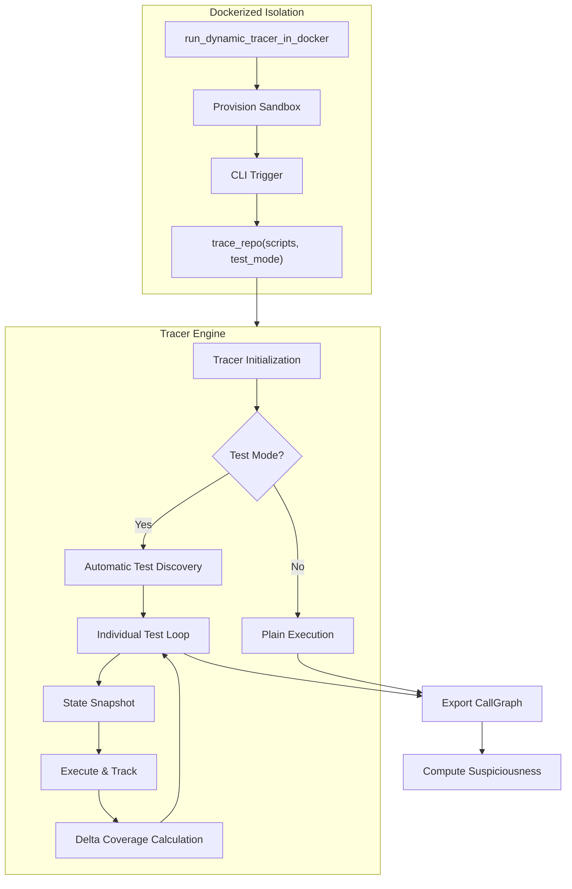

# KG-Guided Codegen: Dynamic Analysis Framework

A technical framework for tracing Python execution, building dynamic call graphs, and performing automated fault localization using the **Tarantula** metric.

## System Overview

The framework is composed of three primary decoupled layers:

1.  **Program Analysis Module**: Traces execution and builds a dynamic CallGraph model, keeping track of the suspiciousness and coverage of each function.
2.  **Execution Sandbox**: Provides isolated Docker environment for running code.
3.  **Reasoning Agent**: A LangGraph-based agent for hypothesis-driven algorithmic debugger.

### Unified Tracer Flow

The core analysis pipeline ensures consistency across both local and containerized execution environments.




---

## API Guide

### 1. Dynamic Tracing
The primary entry point for analysis is `trace_repo`.

**Programmatic Usage:**
```python
from src.program_analysis import trace_repo

call_graph = trace_repo(
    repo_root="./target_repo",
    scripts=["tests/test_logic.py"],
    test_mode=True
)
```

**CLI Usage:**
```bash
uv run -m src.program_analysis.dynamic_call_graph --repo . --scripts test_file.py --test-mode
```

### 2. Visualization
Generate an interactive HTML dashboard from the exported `CallGraph` JSON.
```bash
uv run -m src.program_analysis.visualize_call_graph
```

---

## Fault Localization: The Tarantula Metric

The framework implements the **Tarantula** algorithm to rank functions by their likelihood of containing a bug.

$$
Suspiciousness(n) = \frac{\frac{failed(n)}{total\_failed}}{\frac{passed(n)}{total\_passed} + \frac{failed(n)}{total\_failed}}
$$

- **1.0**: Node executed exclusively by failing tests (High Priority).
- **0.0**: Node executed exclusively by passing tests (Low Priority).
