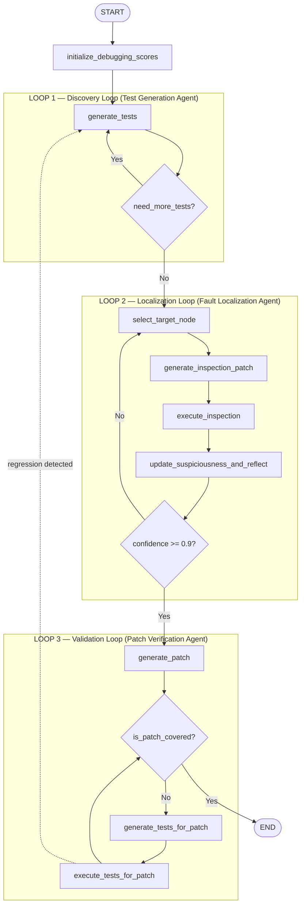
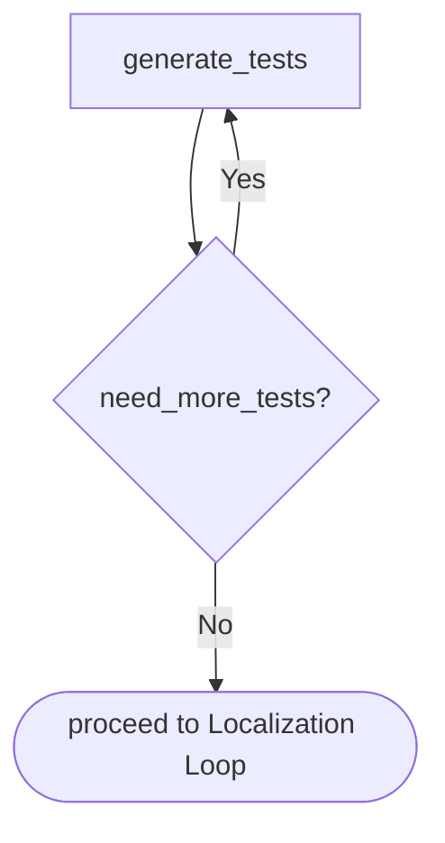
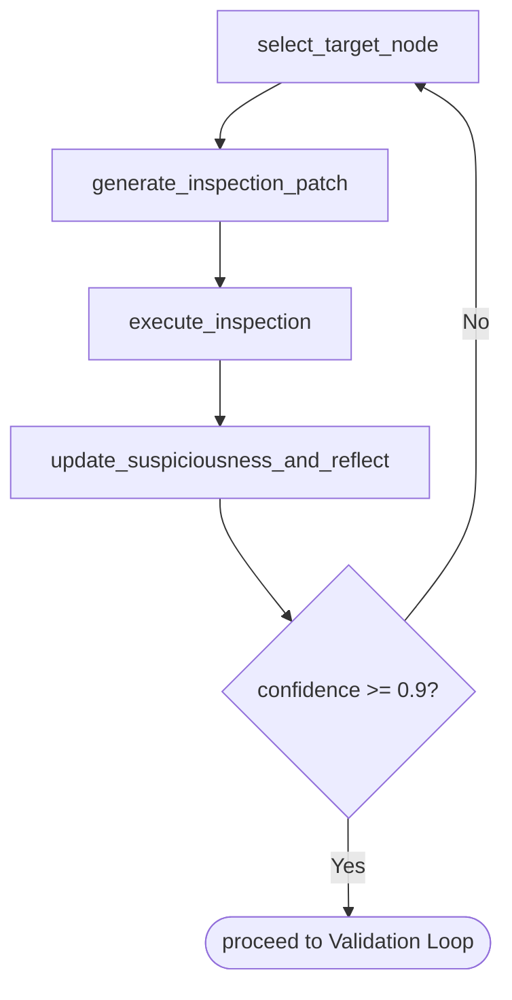
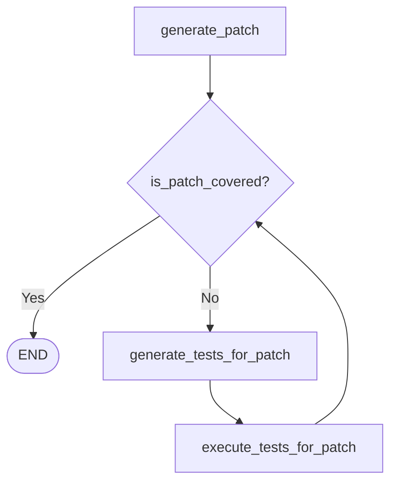
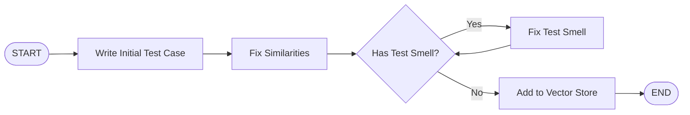
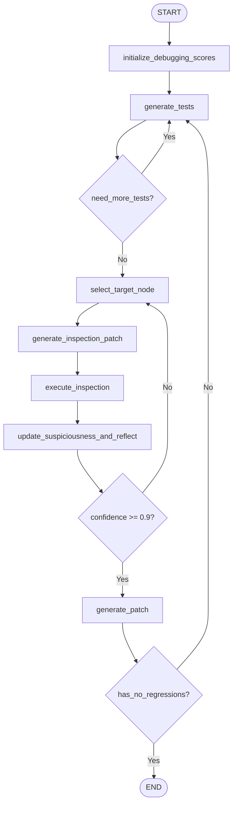

# EQUISA: Extended Multi-Agent Framework for Debugging and Patching

This document describes the proposed extension of the fault localization agent into a full-loop debugging and patching system. The architecture is organized as three named loops orchestrated by cooperating agents.

---

## Table of Contents

1. [Key Problems Addressed](#1-key-problems-addressed)
2. [Architecture Overview](#2-architecture-overview)
3. [Agent Roles](#3-agent-roles)
4. [Loop 1 — Discovery Loop (Test Generation)](#4-loop-1--discovery-loop)
5. [Loop 2 — Localization Loop (Fault Localization)](#5-loop-2--localization-loop)
6. [Loop 3 — Validation Loop (Patch Verification)](#6-loop-3--validation-loop)
7. [End-to-End Flow](#7-end-to-end-flow)
8. [Test Generation Agent — Background](#8-test-generation-agent--background)
9. [Open Design Questions](#9-open-design-questions)
10. [Technical TL;DR](#10-technical-tldr)
- [Appendix A — LangGraph Definition](#appendix-a--langgraph-definition)
- [Appendix B — Prompt Catalogue](#appendix-b--prompt-catalogue)

---

## 1. Key Problems Addressed

This framework is motivated by two fundamental weaknesses in spectrum-based fault localization and LLM-based patching:

### Problem 1 — Coincidental Hits and Ambiguity in Suspiciousness

Spectrum-based metrics like Tarantula assign suspiciousness based on how strongly a function correlates with failing tests. However, this correlation is easily polluted by **coincidental hits**: functions that happen to execute alongside the actual bug but are themselves innocent. When multiple functions are always covered by the exact same set of tests, they form an **ambiguity group** — a set of nodes that Tarantula cannot distinguish between. The suspiciousness signal is spread across the entire group, blurring the agent's focus and potentially sending it after the wrong function.

**How the Discovery Loop solves this:** The Test Generation Agent receives a specific node (or ambiguity group) and generates targeted tests designed to cover individual functions within that group while _not_ covering others. This **dilutes** the suspiciousness of innocent nodes — if a newly generated test covers node A but not node B, and that test passes, then node A's suspiciousness drops while node B's remains high. By surgically adding fine-grained tests, the system breaks ambiguity groups apart and concentrates suspiciousness on the actual culprits before the Fault Localization Agent begins its inspection loop.

### Problem 2 — Patch Regressions

An LLM-generated patch that fixes the localized bug may inadvertently break other functionality. Functions have callers, and a change in one function's behavior can cascade through the call graph. Without re-running the full test suite after patching, these regressions go undetected.

**How the Validation Loop solves this:** After a patch is generated, the entire existing test suite is re-run. If any previously passing test now fails, the patch is rejected and the system loops back for a revised fix.

### Problem 3 — Patch Overfitting

A patch that makes the previously failing tests pass is not necessarily correct. The LLM may produce a fix that merely satisfies the exact inputs from the failing test — for example, by hard-coding a return value or adding a special-case branch — rather than correcting the underlying logic. Such a patch passes the existing tests but fails on any new input that exercises the same behavior.

**How the Validation Loop solves this:** The Test Generation Agent is invoked _after_ patching with a specific mandate: generate new tests that exercise the same behavior the original failing tests were targeting, but with **different inputs**. These tests isolate the intended behavior and verify it holds generally, not just for the inputs the LLM has already seen. If the patch is overfitting, these novel-input tests will fail because the hard-coded fix does not generalize. Only patches that pass both the original suite (no regressions) and the newly generated behavioral tests (no overfitting) are accepted.

---

## 2. Architecture Overview

The system chains three iterative loops, each owned by a specialized agent:



If the validation loop detects regressions, control returns to the Discovery Loop to regenerate tests and re-enter localization.

---

## 3. Agent Roles

| Agent | Responsibility | Origin |
|---|---|---|
| **Test Generation Agent** | Generates high-coverage, smell-free unit tests targeting uncovered lines. Uses a coverage-feedback loop with similarity analysis and LLM-critic quality checks. | LangChain pipeline from Zemann et al. (separate repo). |
| **Fault Localization Agent** | Iteratively inspects call-graph nodes, applies Bayesian updates to suspiciousness scores, and converges on the buggy function. | Current `src/agent/` implementation (see `readme-agent.md`). |
| **Patch Verification Agent** | Applies the generated fix, runs regression and semantic tests, and decides whether the patch is accepted. | New — to be implemented. |

The Test Generation Agent and Fault Localization Agent are independently developed systems. This framework composes them into a single end-to-end pipeline where the Test Generation Agent maps the codebase, the Fault Localization Agent finds the fault, and the Patch Verification Agent guards the fix.

---

## 4. Loop 1 — Discovery Loop

**Owner:** Test Generation Agent

**Purpose:** Produce a comprehensive test suite and compute an initial coverage-and-suspiciousness profile over the call graph.

### Flow



### What happens

1. **Test discovery and generation.** Walk the workspace for existing `test_*.py` files. Optionally invoke the Test Generation Agent to synthesize additional tests targeting coverage gaps.
2. **Dynamic tracing.** Run all tests through the dynamic call graph tracer to produce per-node coverage and Tarantula suspiciousness scores.
3. **Ambiguity check.** The `SuspiciousnessController` identifies ambiguity groups — sets of nodes covered by the exact same tests and therefore indistinguishable. If large ambiguity groups exist, the Test Generation Agent can generate disambiguating tests (targeted at isolating specific nodes from their group).
4. **Exit condition.** When no large ambiguity groups remain or a test budget is exhausted, proceed to Loop 2.

### Interaction with Suspiciousness Control

Ambiguity groups are the primary signal for `need_more_tests?`. A group of size > 1 means the current test suite cannot distinguish between those nodes — any of them could be the bug. Generating a test that executes only a subset of the group breaks the ambiguity and refines the suspiciousness distribution before localization begins.

---

## 5. Loop 2 — Localization Loop

**Owner:** Fault Localization Agent

**Purpose:** Narrow down the root cause to a single function by iteratively inspecting the most suspicious node and updating scores via Bayesian inference.

### Flow



### What happens

1. **Select target.** Pick the valid node with the highest `confidence_score`.
2. **Generate inspection patch.** LLM produces a modified version of the function with assertion-based invariant checks and a heartbeat print for coverage verification.
3. **Execute.** Apply the patch to the source file, run the relevant tests (locally or in Docker), capture exit code / stdout / stderr. Restore original source immediately after.
4. **Reflect and update.** Combine three signal sources:
   - **Formal signals:** heartbeat coverage, assertion failure in target file, test exit code.
   - **LLM reflection:** classifies the function as `CONFIRMED_BUGGY` or `CONFIRMED_NOT_BUGGY`, enforcing the Golden Rule of Callees (a function is not buggy if the fault lies in a callee it invoked correctly).
   - **Bayesian update:** maps the combined outcome to likelihood values and applies Bayes' theorem to compute a posterior `confidence_score`.
5. **Termination.** Once any node's score reaches ≥ 0.9, it is declared the localized fault and control moves to Loop 3.

Full details on the Bayesian calculations and likelihood tables are in `readme-agent.md`.

---

## 6. Loop 3 — Validation Loop

**Owner:** Patch Verification Agent

**Purpose:** Generate a fix for the localized bug and verify it does not introduce regressions or overfit to the failing tests.

### Flow



### What happens

1. **Generate patch.** The LLM receives the buggy function's source and the accumulated reflection, and produces a minimal fix.
2. **Patch acceptance criteria.** A patch is considered good if:
   - Previously failing tests now pass.
   - No regressions are introduced on the existing test suite.
   - The fix is not overfitting (i.e., it does not hard-code expected outputs or narrowly satisfy only the known failing inputs).
3. **Regression testing.** Run the full existing test suite against the patched code. If any previously passing test now fails, the patch is rejected.
4. **Semantic validation (anti-overfitting).** Generate new tests that replicate the _semantics_ of the previously failing tests but use different inputs. If the patch only works for the exact failing inputs, these new tests will expose the overfitting.
5. **Re-entry.** If the patch fails validation, control can return to the Discovery Loop (regenerate tests with updated coverage) or directly back to `generate_patch` with updated feedback.

### Relationship to the Test Generation Agent

The `generate_tests_for_patch` step reuses the Test Generation Agent but with a different objective: instead of maximizing general coverage, it generates tests that specifically exercise the patched function with novel inputs to validate the fix's generality.

---

## 7. End-to-End Flow

| Phase | Loop | Key Output |
|---|---|---|
| Initialization | — | Call graph with normalized confidence scores |
| Test Amplification | Discovery | Comprehensive test suite, refined suspiciousness, reduced ambiguity groups |
| Bug Localization | Localization | `target_node` with confidence ≥ 0.9, accumulated reflection |
| Fix Generation | Validation | `final_patch` and `final_diff` that pass regression + semantic checks |

The three loops execute sequentially. The only backward edge across loops is from the Validation Loop back to the Discovery Loop when a patch fails regression testing, which triggers re-localization with an updated test suite.

---

## 8. Test Generation Agent — Background

Based on Zemann, Rehan & Yacob: *"Understanding the Robustness of Code Coverage in Unit Test Generation by Large Language Models supported by LangChain"* (HPI).

### Pipeline



### Key Components

| Node | Function |
|---|---|
| **Initial Test Generation** | Uses the source code under test + coverage gaps (uncovered lines) + samples from existing tests (via vector store) to generate a new test targeting uncovered paths. |
| **Similarity Analysis** | Computes cosine similarity between the new test's embedding and existing tests in an in-memory vector store. Redundant tests are rewritten to target different paths. |
| **Test Quality Assessment (Router)** | LLM critic evaluates the test for test smells (fragile tests, assertion roulette, etc.). Routes to improvement or acceptance. |
| **Test Quality Improvement** | LLM rewrites the test to fix identified smells while preserving the test's coverage intent. Loop bounded by an improvement budget counter. |
| **Vector Store Integration** | Accepted test is embedded and added to the store for future similarity lookups. |

### State

- Source code under test
- Coverage metrics (uncovered lines via Coverage.py)
- Vector store of existing tests (embeddings for similarity)
- Improvement budget (loop counter)
- Identified test smells

### Key Results from the Paper

- ~20% average coverage improvement over single-shot LLM baseline (GPT-4o).
- Smaller models (GPT-4o-mini) converge to the same asymptotic coverage after ~10 generations, making the approach cost-effective.
- Coverage plateaus after ~10 test generations with the current pipeline.

---

## 9. Open Design Questions

| Question | Context |
|---|---|
| **How to detect overfitting in patches?** | A patch that hard-codes expected outputs passes the original failing test but fails on novel inputs with the same semantics. The Validation Loop needs a reliable method to generate these semantic-equivalent inputs. |
| **Regression scope** | Should regression testing run the entire test suite or only tests related to the patched function's callers? Full-suite is safer but slower. |
| **Multi-agent orchestration** | How should the three agents communicate? Options: (a) shared LangGraph state, (b) message-passing between independent graphs, (c) a supervisor agent that dispatches to sub-agents. |
| **Test budget allocation** | How many tests should the Discovery Loop generate before handing off to localization? Too few leaves ambiguity; too many wastes compute. |
| **Loop re-entry depth** | If the Validation Loop fails and re-enters Discovery, should localization restart from scratch or continue from the current score distribution? |

---

## 10. Technical TL;DR

The system takes a buggy codebase and produces a verified patch through three phases:

**Phase 1 — Build the map.** The Test Generation Agent creates a thorough test suite. Each test is run through a dynamic tracer that records which functions were called. This produces a call graph where every function has a Tarantula suspiciousness score derived from how strongly it correlates with failing tests. Functions that are always covered together (ambiguity groups) are flagged, and additional disambiguating tests are generated until each function can be told apart.

**Phase 2 — Find the bug.** The Fault Localization Agent takes the scored call graph and enters a loop. Each iteration: pick the most suspicious function, inject assertions into it, run the tests, observe what happens. Three signals come back — did the function execute (heartbeat), did its assertions fail, did the tests pass or fail — and the LLM interprets the execution output to judge whether the function itself is at fault or whether the failure originated in a callee. These signals are fed into Bayes' theorem to update the function's probability of being buggy. The loop repeats, each time sharpening the distribution, until one function crosses the 0.9 confidence threshold.

**Phase 3 — Fix and verify.** The LLM generates a minimal patch for the localized function. The patch is tested against the full existing suite (regression check) and against newly generated tests that use different inputs with the same semantics (overfitting check). If both pass, the patch is accepted. If not, the system loops back — either regenerating the patch with feedback, or returning all the way to Phase 1 with updated coverage data.

The key insight tying everything together: **tests are not just for validation — they are the sensing mechanism**. The Test Generation Agent generates tests to _see_ into the codebase. The Fault Localization Agent uses test outcomes as _evidence_ for Bayesian reasoning. The Patch Verification Agent uses tests to _prove_ the fix is correct. Each loop consumes and produces tests, making the test suite the shared substrate that all three agents operate on.

---

## Appendix A — LangGraph Definition

**State:** `DebuggingState`
**Source:** `src/agent/graph.py` → `build_debugging_agent()`

#### Nodes

| Node | Function | LLM Call |
|---|---|---|
| `initialize_debugging_scores` | Normalizes Tarantula scores into a confidence distribution | No |
| `generate_tests` | Discovers test files, runs dynamic tracer, computes coverage | No |
| `select_target_node` | Picks the node with the highest `confidence_score` | No |
| `generate_inspection_patch` | LLM injects assertions into the target function | Yes |
| `execute_inspection` | Applies patch, runs tests, restores original source | No |
| `update_suspiciousness_and_reflect` | LLM reflects on results; Bayesian update of scores | Yes |
| `generate_patch` | LLM generates a fix for the localized bug | Yes |

#### Edges

| From | To | Type | Condition |
|---|---|---|---|
| `START` | `initialize_debugging_scores` | Unconditional | — |
| `initialize_debugging_scores` | `generate_tests` | Unconditional | — |
| `generate_tests` | `select_target_node` | Conditional | `should_generate_more_tests` returns `False` (currently always) |
| `select_target_node` | `generate_inspection_patch` | Unconditional | — |
| `generate_inspection_patch` | `execute_inspection` | Unconditional | — |
| `execute_inspection` | `update_suspiciousness_and_reflect` | Unconditional | — |
| `update_suspiciousness_and_reflect` | `generate_patch` | Conditional | Any node's `confidence_score >= 0.9` |
| `update_suspiciousness_and_reflect` | `select_target_node` | Conditional | No node's `confidence_score >= 0.9` |
| `generate_patch` | `END` | Conditional | `has_no_regressions` returns `True` (currently always) |
| `generate_patch` | `generate_tests` | Conditional | `has_no_regressions` returns `False` |

#### Decision Functions

| Function | Returns `True` when |
|---|---|
| `should_continue_debugging` | Any node in `call_graph["nodes"]` has `confidence_score >= 0.9` |
| `should_generate_more_tests` | Currently always `False` (placeholder) |
| `has_no_regressions` | Currently always `True` (placeholder) |

#### Graph



---

## Appendix B — Prompt Catalogue

All prompts are defined in `src/agent/prompts.py`. Each subsection shows the system instructions and the user-message template constructed in `src/agent/tools.py`.

#### `GENERATE_INSPECTION_PATCH_SYSTEM_INSTRUCTIONS` — Inspection Patch

Used by: `generate_inspection_patch` node

**System instructions:**
```
You are a expert debugger. You are given a function's source code and you need to
provide a MODIFIED version of this function that includes validations (assertions
or mocks) to check if it is buggy.

CRITICAL RULES:
1. ALWAYS include this exact print statement as the VERY FIRST line of the
   function body:
   print(f"--- INSPECTION_START: {target_node} ---")
   (Use the actual target node FQN provided below).
2. ONLY use `assert` statements to check for expected behavior. DO NOT use
   additional print statements for validation or debugging.
3. If you detect an invalid state, raise an AssertionError with a descriptive message.
4. Output ONLY the modified function source code. Do not add explanations or markdown.
5. Include all the original logic, just add your validation checks inside it.
6. Ensure the code is syntactically correct and matches the original function's
   signature.
```

**User message template:**
```
{system_instructions}  (with {target_node} interpolated)

Target Function: {target_node}
Source Code:
{source_code}
```

---

#### `GENERATE_DEBUGGING_REFLECTION_SYSTEM_INSTRUCTIONS` — Debugging Reflection

Used by: `update_suspiciousness_and_reflect` node

**System instructions:**
```
You are an expert debugger reflecting on the results of an inspection patch execution.
Given the target function, its source code, the inspection patch that was run, and
the execution results (stdout/stderr/exit code), you must determine if the function
is likely buggy.

THE GOLDEN RULE OF CALLEES:
- If the target function fails because a function it CALLS (a dependency/callee)
  returned a wrong value, but the target function's own logic is correct and it
  used that value correctly, then the target function is NOT_BUGGY.
- Only mark as BUGGY if the error is in the target function's own implementation
  or if it passed incorrect arguments to a callee.

Rules:
- First, provide a detailed reasoning and evidence analysis. Analyze the traceback
  carefully to see where the exception actually originated.
- After your reasoning, provide your final decision on a new line using exactly one
  of these two labels: "CONFIRMED_BUGGY" or "CONFIRMED_NOT_BUGGY".
- Be extremely strict: if the root cause is elsewhere, the current node is innocent.
```

**User message template:**
```
{system_instructions}

Target Function: {target_node}
Source Code:
{source_code}

Inspection Patch:
{patch}

Execution Result:
{execution_result}
```

---

#### `GENERATE_PATCH_SYSTEM_INSTRUCTIONS` — Patch Generation

Used by: `generate_patch` node

**System instructions:**
```
You are an expert debugger. You are given a function's source code and a reflection
describing why it is buggy.
Your task is to generate a fixed version of the function that resolves the bug.

CRITICAL RULES:
1. Output ONLY the fixed function source code.
2. Do not add explanations, markdown, or surrounding text.
3. Ensure the code is syntactically correct and matches the original function's
   signature.
4. The fix should be minimal and directly address the issues identified in the
   reflection.
```

**User message template:**
```
{system_instructions}

Target Function: {target_node}
Source Code:
{source_code}

Reflection:
{reflection}
```
