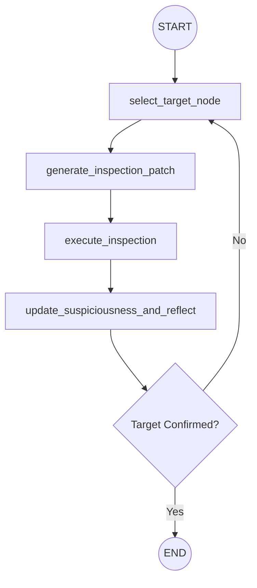

# Self-Reflection based Fault localization Agent

This module implements a LangGraph-based agentic system for debugging software defects. 

## Motivation

Standard LLMs often struggle with software debugging because they lack a reliable signal to converge towards the exact root cause of a defect. In many cases, LLMs rely on a "hit-and-trial" approach, making educated guesses without a formal mechanism to validate them or narrow down the search space. This results in instability and unpredictable performance when locating bugs in complex systems. To address this, we introduce a **formal feedback loop** that guides the agent's reasoning. 

## Agent Architecture

### Debugging Agent
An "algorithmic debugger" that uses dynamic call graph data to iteratively inspect and narrow down root causes.

## Technical Components

### State Management (`state.py`)
Agents use Pydantic-based state objects (`OneShotCodeGenState`, `DebuggingState`) to persist information across nodes, including:
- `messages`: Conversation history.
- `generated_code`: The current candidate solution.
- `call_graph`: Dynamic analysis data used for fault localization.
- `history`: A structured log of agent decisions and tool outputs.

### Nodes (`nodes.py`)
Each node in the graph is a discrete Python function that performs a specific task (e.g., calling an LLM, running a test, or updating a score).

### Tools (`tools.py`)
A collection of utilities used by nodes to interact with the system:
- **LLM Connectors**: Standardized interface for local/remote models.
- **Source Utilities**: Tools for reading and patching specific functions.
- **Local Execution**: Running tests and capturing output.
