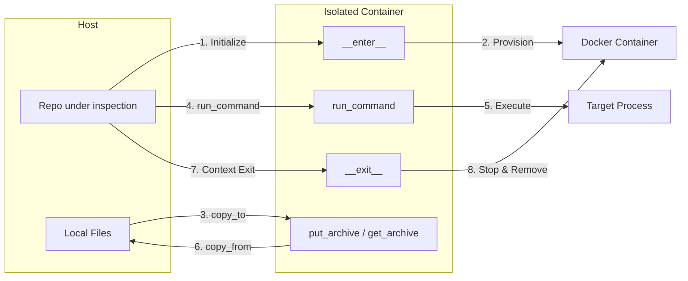

# Docker Sandbox Utils

## Sandbox Lifecycle

The `SimpleDockerSandbox` manages the transition between the host environment and the isolated container.



## `SimpleDockerSandbox` Class

The primary interface for containerized execution. It manages the lifecycle of a Docker container and provides an API for interaction.


### Example

```python
from src.docker_utils.basic_container import SimpleDockerSandbox

# Use as a context manager for automatic cleanup
with SimpleDockerSandbox(image_name="python:3.11-slim") as sandbox:
    # 1. Prepare the environment
    sandbox.copy_to("./local_repo", "repo")
    
    # 2. Execute commands
    exit_code, stdout, stderr = sandbox.run_command("pip install -r repo/requirements.txt")
    
    # 3. Run analysis or tests
    exit_code, stdout, stderr = sandbox.run_command("pytest repo/test_suite.py")
    
    # 4. Retrieve results
    sandbox.copy_from("repo/coverage.json", "./artifacts/coverage.json")
```